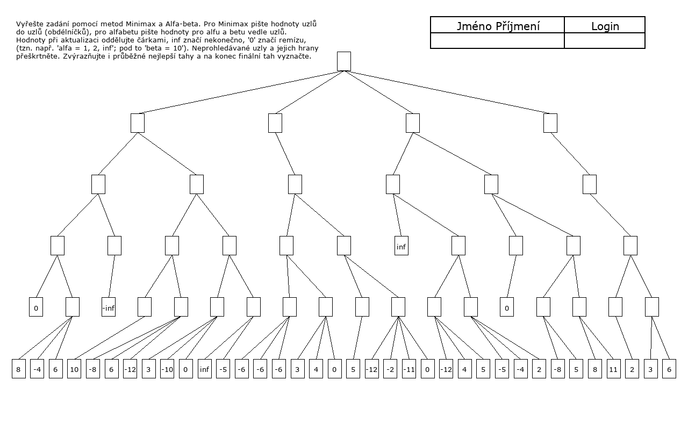
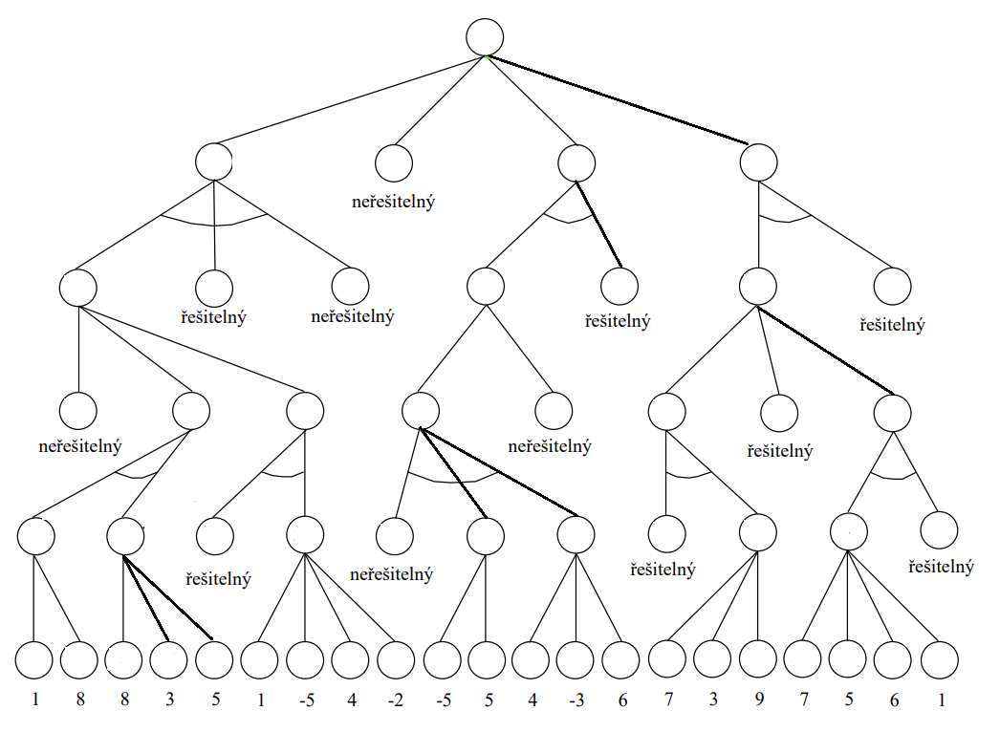
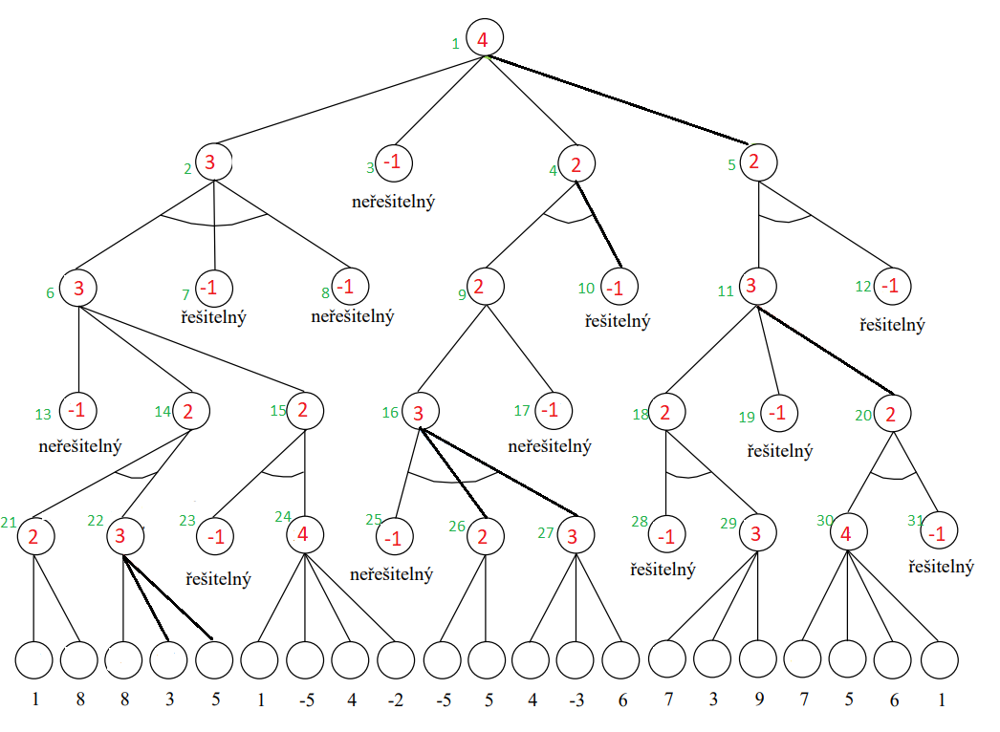
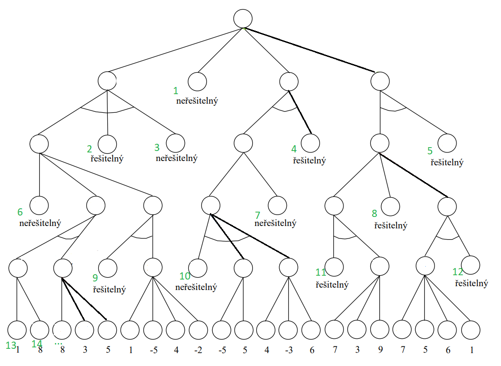

# AlphaBeta-MinMax
## Turbomošt
### Compiling


```bash
make
```

### Guide

```bash
./run [terminals left to right, top to bottom]{40}
```
Run with 2021/2022 structure and custom terminals. Order is from left to right, top to bottom - your input should start with **./run inf 0 -inf 0**.

```bash
./run help
./run custom help
```
Print help or help for custom sturctures.

### Example


```bash
./run inf 0 -inf 0 8 -4 6 10 -8 6 -12 3 -10 0 inf -5 -6 -6 -6 3 4 0 5 -12 -2 -11 0 -12 4 5 -5 -4 2 -8 5 8 11 2 3 6
```

### Custom input:

```bash
./run custom [structure] end [terminals] end
```
Custom structure is number of branches from left to right, top to bottom.
Custom terminals order is from left to right, top to bottom.
In the previous example custom input would be:

```bash
./run custom 4 2 1 2 1 2 2 2 2 2 1 2 1 2 2 2 2 -1 2 1 2 2 -1 3 -1 1 3 3 2 3 3 1 4 3 3 -1 2 2 1 2 end inf 0 -inf 0 8 -4 6 10 -8 6 -12 3 -10 0 inf -5 -6 -6 -6 3 4 0 5 -12 -2 -11 0 -12 4 5 -5 -4 2 -8 5 8 11 2 3 6 end
```

Let's see another exapmple:


```
řešitelný = inf
neřešitelný = -inf
```

First you need to input structure of the problem:
- Red numbers indicate number of branches for each node
- Green numbers indicate input order





```bash
./run custom 4 3 -1 2 2 3 -1 -1 2 -1 3 -1 -1 2 2 3 -1 2 -1 2 2 3 -1 4 -1 2 3 -1 3 4 -1 end ...
```

And for the last part you need to input terminals:
- Green numbers indicate input order



```bash
./run custom 4 3 -1 2 2 3 -1 -1 2 -1 3 -1 -1 2 2 3 -1 2 -1 2 2 3 -1 4 -1 2 3 -1 3 4 -1 end -inf inf -inf inf inf -inf -inf inf inf -inf inf inf 1 8 8 3 5 1 -5 4 -2 -5 5 4 -3 6 7 3 9 7 5 6 1 end
```
